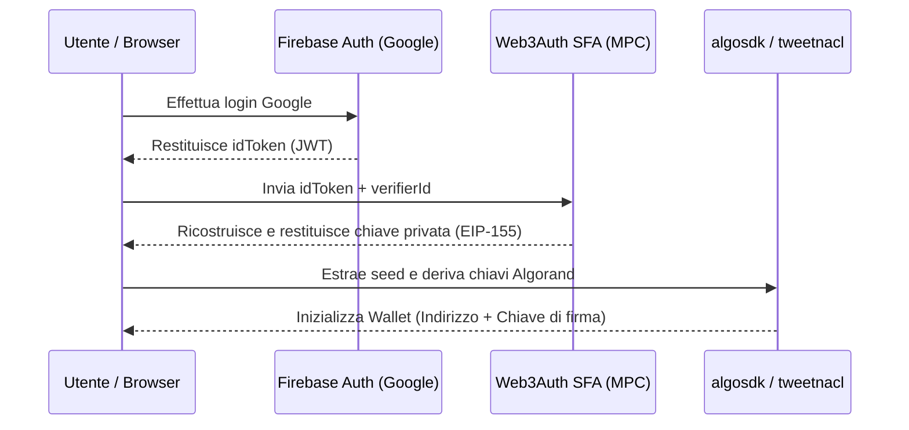

# ADR-001: Integrazione Wallet Algorand Non-Custodial (MPC)

Questo documento descrive i dettagli tecnici dell'implementazione del wallet Algorand MPC integrato all'accesso Google Firebase dell'applicazione **El Fontanin**.

## Architettura

Il sistema utilizza un modello **non-custodial** basato su **MPC (Multi-Party Computation)** via MetaMask Embedded Wallets (Web3Auth Single Factor Auth). 



## Flusso Tecnico

1. **Autenticazione Firebase:** L'utente esegue l'accesso con Google su Firebase Auth. Viene ottenuto l'ID Token JWT del client.
2. **Connessione Web3Auth (MPC):** Il JWT Firebase viene passato a `@web3auth/single-factor-auth` su rete `sapphire_devnet` (o `sapphire_mainnet` in produzione). Web3Auth valida il JWT tramite l'endpoint JWKS di Google e ricostruisce la chiave privata client-side in modo non-custodial.
3. **Derivazione Algorand:** 
   La chiave privata grezza a 256 bit (32 byte) fornita da Web3Auth viene trattata come seed entropico per la firma ed25519.
   Utilizzando `tweetnacl`, viene derivata la keypair pubblica/privata conforme allo standard Algorand:
   ```javascript
   const keys = nacl.sign.keyPair.fromSeed(privateKeyBytes);
   const secretKey = new Uint8Array(64);
   secretKey.set(keys.secretKey);
   const algorandAddress = algosdk.encodeAddress(keys.publicKey);
   ```
4. **Firma delle Transazioni:** 
   Il provider espone una funzione `signTransaction(txn)` che firma transazioni Algorand client-side senza mai inviare la chiave privata al server:
   ```javascript
   const signedTxn = txn.signTxn(secretKey);
   ```

## Variabili d'Ambiente Richieste

Le seguenti variabili devono essere configurate nel file `.env.local` / `.env`:
* `VITE_WEB3AUTH_CLIENT_ID`: Il Client ID ottenuto dalla MetaMask Developer Dashboard / Web3Auth Dashboard.
* `VITE_WEB3AUTH_VERIFIER_NAME`: Il nome del custom JWT verifier configurato sulla dashboard per convalidare i token Firebase.

## Policy di Recupero (Recovery Policy)

> [!IMPORTANT]
> **Punto Aperto (Governance):**
> Come stabilito dall'ADR-001, **non è stato implementato alcun meccanismo di recovery autonomo**. La decisione sulla policy di recupero (es. social recovery, backup crittografati, ecc.) è di esclusiva competenza del Consiglio Direttivo dell'Associazione Fine di Mondo APS e sarà definita in una fase successiva.
